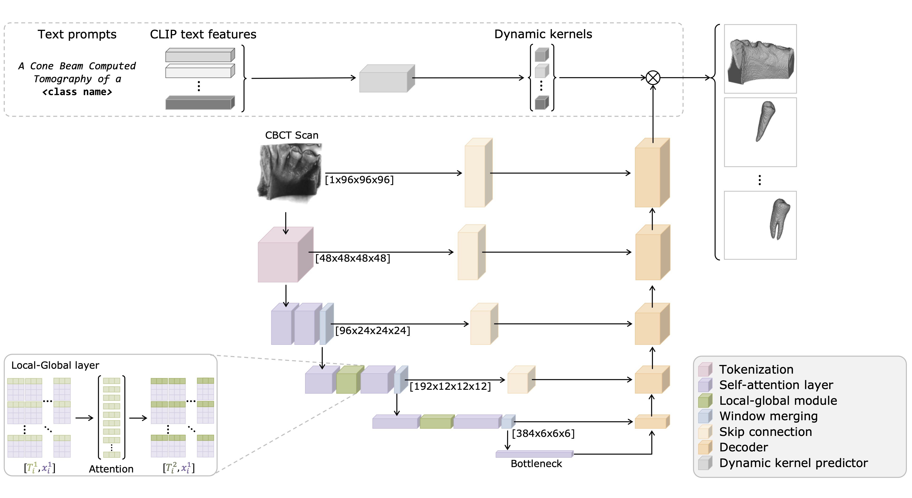

# DiENTeS

Official implementation of **"DiENTeS: Dynamic entity segmentation with local-global transformers"**.

<div align="center">
  
</div>

## Overview

DiENTeS utilizes a transformer-based backbone to extract localized features and propagate them to form a comprehensive global representation. Additionally, it incorporate language features to guide the segmentation process, enabling the generation of specialized convolutional kernels for each category.

## Citation

If you find this code useful for your research, please cite:

```bibtex
@inproceedings{daza2024dientes,
  title={DiENTeS: Dynamic entity segmentation with local-global transformers},
  author={Daza, Laura and Schnabel, Julia},
  booktitle={International Conference on Medical Image Computing and Computer-Assisted Intervention},
  pages={21--29},
  year={2024},
  organization={Springer}
}
```
